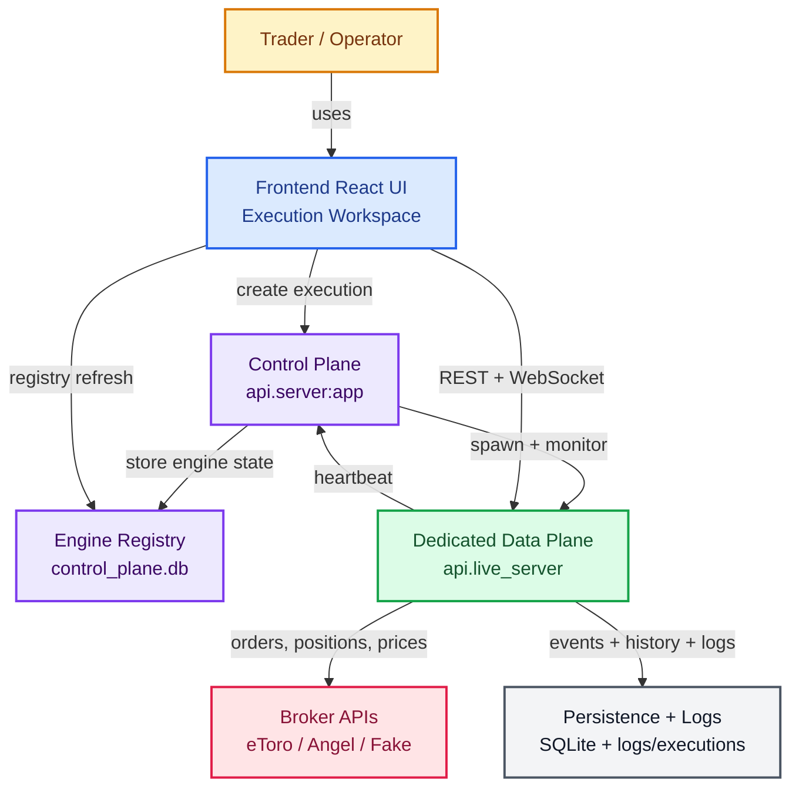
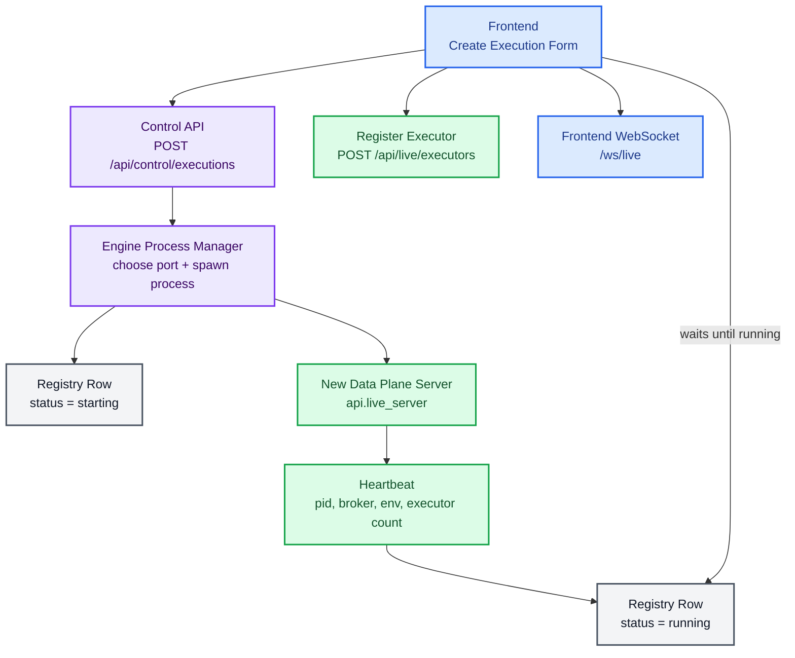
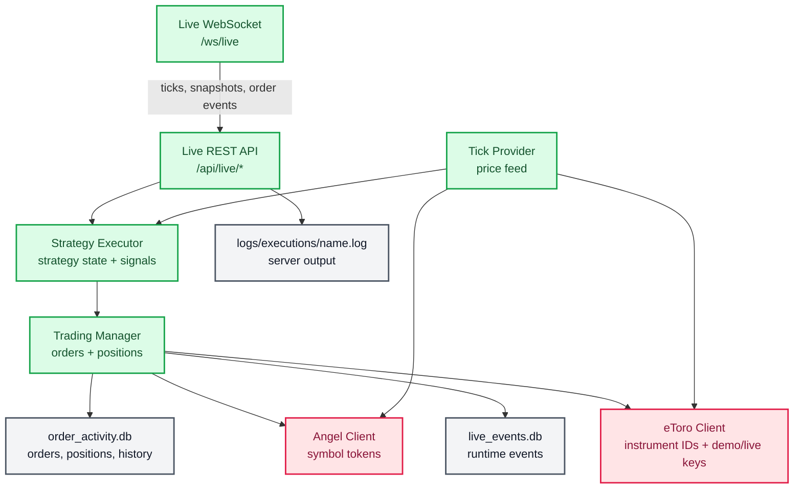

# Backtrading Architecture Workflow

This diagram shows the high-level runtime architecture and how execution creation, data-plane lifecycle, broker communication, heartbeats, realtime updates, persistence, and logs fit together.

## High-Level Runtime View

## Execution Creation Lifecycle

## Data Plane Internals

## Runtime Flow

1. The frontend asks the control plane to create a new execution.
2. The control plane allocates a port and starts a dedicated data-plane process.
3. The data plane heartbeats back to the control plane, which keeps `control_plane.db` up to date.
4. The frontend reads the registry, gets the data-plane REST and WebSocket URLs, and connects to that engine.
5. The data plane handles strategy execution, ticks, orders, positions, events, and broker calls.
6. eToro executions use eToro instrument IDs as the broker token; Angel executions use Angel symbol tokens.
7. Realtime data streams back over `/ws/live`, while history and current state are persisted in SQLite.
8. Each spawned execution server writes logs to `logs/executions/<execution-name>.log`.
