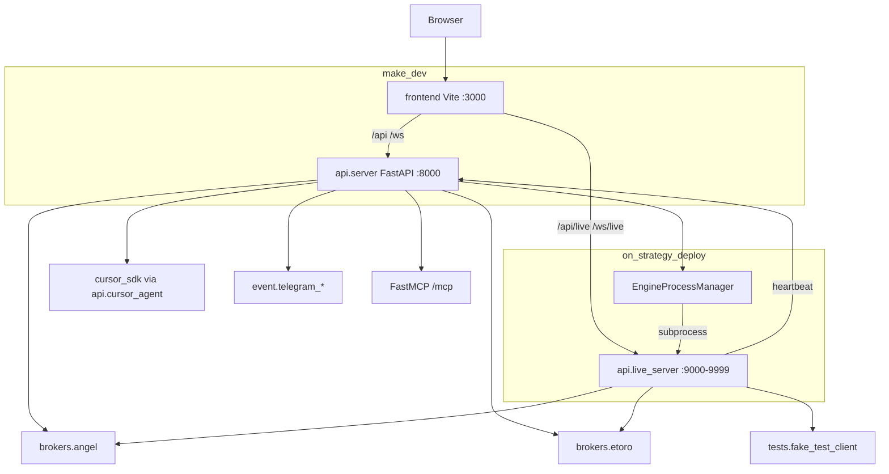

# System context (runtime)

## Diagram



## Processes

| Process | Entry | Role |
|---------|--------|------|
| Control plane | `uvicorn api.server:app` | Registry, executions, portfolio/search, AI research, WS proxy, backtest |
| Live engine | `python -m api.live_server` | Ticks, strategies, orders, `/api/live/*`, `/ws/live` |
| Frontend | Vite `:3000` | Proxies to CP and live engine |

## Commands

```bash
make dev    # CP :8000 + frontend :3000
make cp     # control plane only
make fe     # frontend only
```

Live engines are spawned on strategy deploy via `control_plane/engine_process_manager.py`, not by `make dev`.
