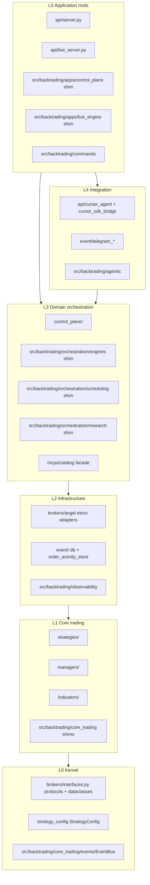
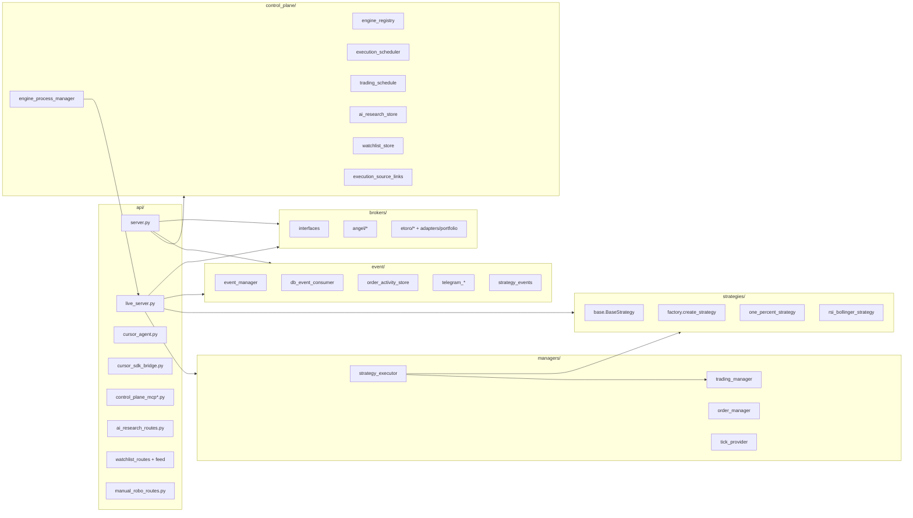

# Layers and modules

The repo uses a **dual layout**: legacy root packages plus `src/backtrading/` shims toward the target modular layout.

## Target layers vs current code

## Python package map

## Dependency rules (target)

| Layer | May import |
|-------|------------|
| L0 | stdlib, typing |
| L1 | L0 |
| L2 | L0–L1 |
| L3 | L0–L2 via facades |
| L4 | L3 interfaces + L0 types |
| L5 | facades + wiring only |

Forbidden: `core_trading` → telegram/cursor/apps; `apps` → concrete `brokers.angel` directly.
