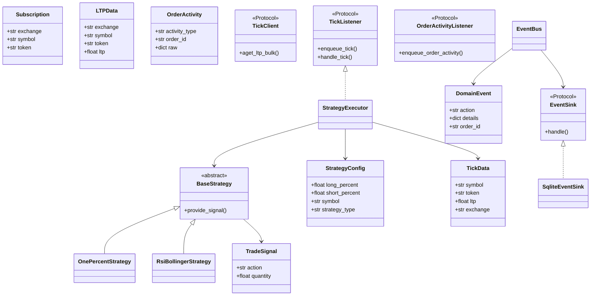

# Domain models and protocols (L0)

## Class diagram

## Type index

| Type | Location | Purpose |
|------|----------|---------|
| `TickData`, `Subscription`, `LTPData`, `OrderActivity` | `brokers/protocols.py` (`interfaces` shim) | Broker/tick contracts |
| `TradeSignal` | `strategies/base.py` | Strategy output |
| `StrategyConfig` | `strategy_config.py` | Runtime strategy parameters |
| `DomainEvent`, `EventBus` | `src/backtrading/core_trading/events/bus.py` | Async event pipeline (target; partial wiring) |
| `Tick` | `tick.py`, `__init__.py` | Legacy backtest model |

## Strategy registry

`strategies/factory.py` → `create_strategy(config)`:

- `one-percent` (default) → `OnePercentStrategy`
- `rsi-bollinger` aliases → `RsiBollingerStrategy`
