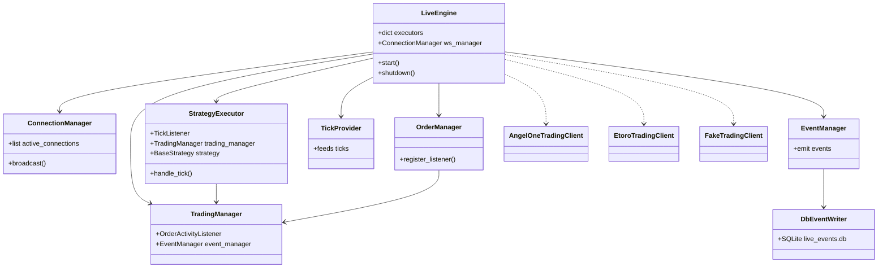
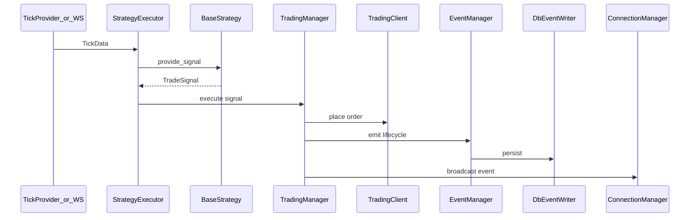

# Live engine (data plane)

Entry: `python -m api.live_server` (spawned by `EngineProcessManager` on deploy).

## Class graph

## Tick → order flow

## Key REST / WS paths

| Path | Handler area in `api/live_server.py` |
|------|--------------------------------------|
| `GET /health` | Engine health / degraded |
| `GET /api/live/engine-info` | Registry heartbeat payload |
| `GET /api/live/executors` | Running strategy executors |
| `POST /api/live/executors` | Register executor |
| `GET /api/live/events` | Event log |
| `WS /ws/live` | Live stream to UI |

## CLI flags

`--fake`, `--port`, `--env`, `--engine-id`, `--control-url`, `--broker`, `--strategy-name`, `--symbol`, `--token`, `--client-mode`, `--feed-mode`
