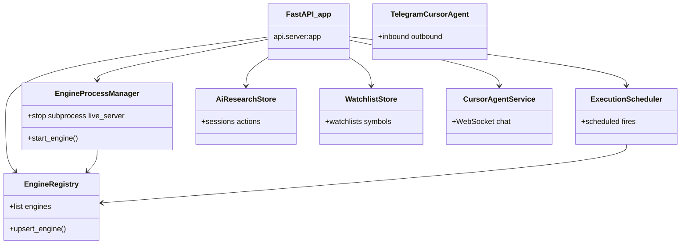

# Control plane

Entry: `uvicorn api.server:app` (what `make dev` starts).

## Service graph

## Pydantic request models (`api/server.py`)

| Model | Use |
|-------|-----|
| `BacktestRequest` | `/api/backtest`, `/ws/backtest` |
| `DataPlaneEngineRequest` | Register engine |
| `DataPlaneEngineUpdate` | Patch engine |
| `ControlPlaneExecutionRequest` | Create/start executions |

## Included routers

| Router module | Prefix / area |
|---------------|----------------|
| `api/manual_robo_routes` | Manual robo |
| `api/cursor_agent` | Strategy AI WS |
| `api/ai_research_routes` | `/api/control/ai-research` |
| `api/workspace_media` | Media attachments |
| `api/watchlist_routes` | Watchlists |
| FastMCP mount | `/mcp` |

## Key control paths

| Path | Purpose |
|------|---------|
| `/api/control/engines` | List/register/heartbeat/stop engines |
| `/api/control/executions` | Saved strategies CRUD + start/stop/schedule |
| `/api/control/portfolio` | Multi-broker portfolio |
| `/api/control/etoro/positions` | eToro positions |
| `/api/control/search` | Instrument search |
| `/ws/control/engines/{id}/live` | Proxy to live engine WS |
| `/ws/control/cursor-agent` | Cursor agent chat |
| `/ws/control/market` | Market stream hub |
| `/ws/backtest` | Backtest stream |

## Orchestration package (`control_plane/`)

| Module | Class / role |
|--------|----------------|
| `engine_registry.py` | `EngineRegistry` |
| `engine_process_manager.py` | `EngineProcessManager` |
| `execution_scheduler.py` | `ExecutionScheduler` |
| `trading_schedule.py` | Schedule helpers |
| `ai_research_store.py` | `AiResearchStore` |
| `watchlist_store.py` | `WatchlistStore` |
| `execution_source_links.py` | Research ↔ execution linking |

Shim target: `src/backtrading/orchestration/{engines,scheduling,research}/`.
