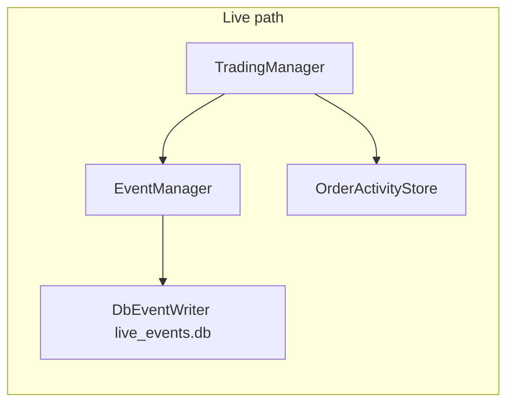
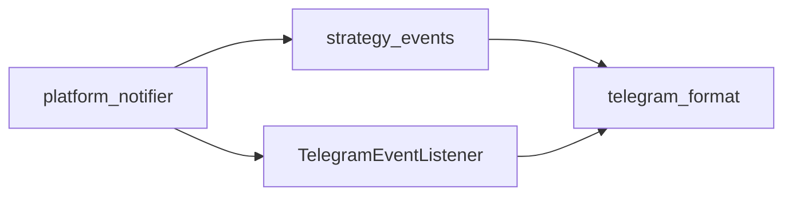
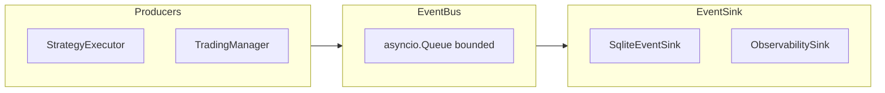
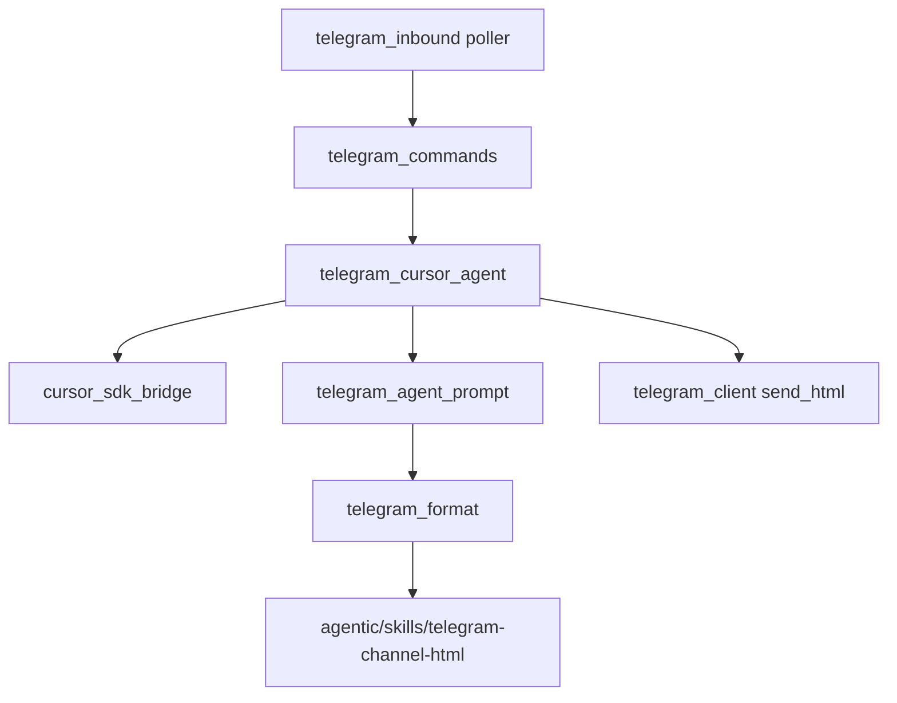

# Events and Telegram

## Live event path (today)

| Class | File | Role |
|-------|------|------|
| `EventManager` | `event/event_manager.py` | Emit strategy/order events |
| `DbEventWriter` | `event/db_event_consumer.py` | SQLite persistence |
| `OrderActivityStore` | `event/order_activity_store.py` | Order activity queries |
| `DbOrderActivityListener` | same file | Listener adapter |

## Platform notifications (control plane)

| Module | Role |
|--------|------|
| `event/strategy_events.py` | Lifecycle constants, detail builders |
| `event/platform_notifier.py` | Bridge engine events → Telegram |
| `event/telegram_listener.py` | `TelegramEventListener` |
| `event/telegram_format.py` | HTML formatting, skill loader |

## Target EventBus

Spec: `docs/event-bus.md`, implementation: `src/backtrading/core_trading/events/bus.py`.

## Telegram agent stack

| Class / type | File |
|--------------|------|
| `TelegramConfig` | `telegram_config.py` |
| `InboundAgentRequest` | `telegram_commands.py` |
| `TelegramCursorAgent` | `telegram_cursor_agent.py` |
| `TelegramInboundPoller` | `telegram_inbound.py` |

Shim package: `src/backtrading/telegram/`.
