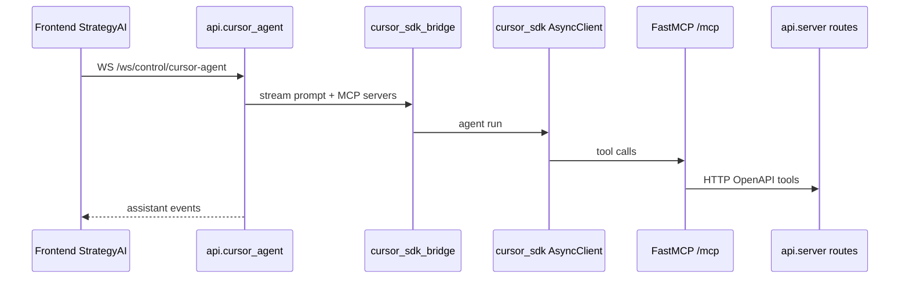
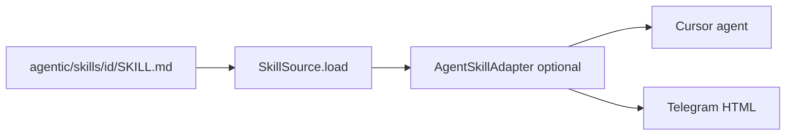

# Agent and MCP integration

## Strategy AI sequence

## Key classes

| Class | File | Role |
|-------|------|------|
| `CursorAgentService` | `api/cursor_agent.py` | WS handler, session state |
| `CursorAgentChatRequest` | `api/cursor_agent.py` | Pydantic WS payload |
| — | `api/cursor_sdk_bridge.py` | SDK client, sessions, streaming |

Bridge helpers: `load_cursor_api_env()`, `control_plane_mcp_servers()`, `sdk_message_payload()`.

Env: `.cursor-api.env` (from `.cursor-api.env.example`).

## MCP modules

| Module | Role |
|--------|------|
| `api/control_plane_mcp_tools.py` | Tool names, hints, regex (`CREATE_STRATEGY_TOOL_RE`, etc.) |
| `api/control_plane_mcp.py` | `CONTROL_PLANE_MCP_PATH`, FastMCP mount |
| `mcps/catalog.py` | Facade for orchestration / agents |
| `src/backtrading/mcps/` | Package shim |

## Agentic skills (universal)

| Piece | Location |
|-------|----------|
| Canonical skills | `src/backtrading/agentic/skills/<id>/SKILL.md` |
| Loader | `src/backtrading/agentic/loader.py` |
| Telegram adapter | `src/backtrading/agentic/adapters/telegram.py` |
| IDE symlink (optional) | `scripts/link-cursor-skills.sh` → `.cursor/skills/` |

Override path: env `BACKTRADING_SKILLS_DIR`.

## Execution ↔ research linking

`control_plane/execution_source_links.py` parses MCP tool results using `mcps.catalog.CREATE_STRATEGY_TOOL_RE` to attach AI research metadata to engines.
