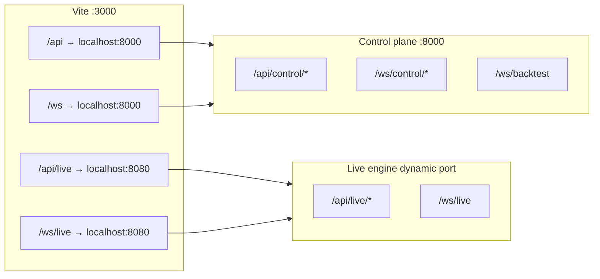

# Frontend and API contract

The UI must keep stable paths and JSON shapes; see `docs/ui-smoke.md` for manual verification.

## Vite proxy (`frontend/vite.config.js`)

Note: Default Vite live proxy targets `:8080`; deployed engines often use `:9000–9999` via control-plane WS proxy `/ws/control/engines/{id}/live`.

## Frontend consumers (examples)

| Frontend module | Backend paths |
|-----------------|---------------|
| `lib/portfolio-cache.ts` | `GET /api/control/portfolio` |
| `lib/aiResearch.ts` | `/api/control/ai-research` |
| `lib/useCursorAgentChat.ts` | `WS /ws/control/cursor-agent` |
| `ExecutionWorkspace.jsx` | `/api/control/executions`, engine WS proxy |
| `LiveTrading.jsx` | `/api/live`, `/ws/live` |
| `lib/controlMarketWs.ts` | `WS /ws/control/market` |
| `pages/insights/LiveServersPage.tsx` | `GET /api/control/engines` |

## Engine registry fields (UI contract)

Engines returned by `/api/control/engines` should preserve:

- `id`, `status`, `broker`, `account_env`
- `api_base_url`, `ws_url`
- `heartbeatFresh`, `last_heartbeat_at` (or equivalent)
- `port`, `host`, `metadata`

Documented in `docs/observability.md`.
