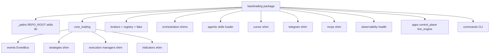

# Legacy code and `src/backtrading/` package

## Legacy roots (do not use in new code)

| Path | Replacement / notes |
|------|---------------------|
| `client.py`, `TotpClient` | `brokers/angel/client.py` |
| `strategy.py`, `backtesting.py` | Backtest-only; target `core_trading/backtest/` |
| `tick.py`, `__init__.py` `Tick` | `brokers.interfaces.TickData` |
| `order.py` `Order` | Backtest order model |
| `main.py`, `temp.py`, `test.py`, `testing.py` | Examples / scratch |
| `examples/legacy/core/` | Former `core/` stubs (`TradingContext`, `OrderService`) — unused |
| `manual_robo/` | Separate robo feature + `api/manual_robo_routes` |

See `examples/legacy/README.md`.

## `src/backtrading/` index



| Package | Points to / contains |
|---------|----------------------|
| `_paths` | `REPO_ROOT`, `AGENTIC_SKILLS_DIR`, `live_events_db_path()` |
| `core_trading.strategies` | `strategies.factory`, `BaseStrategy` |
| `core_trading.execution` | `managers.*` |
| `core_trading.events` | `EventBus`, `DomainEvent`, `SqliteEventSink`, legacy `EventManager` shim |
| `brokers` | Re-exports `brokers.interfaces` |
| `brokers.fake` | `FakeTradingClient` |
| `brokers.registry` | Plugin `register` / `get` |
| `orchestration.engines` | `EngineRegistry`, `EngineProcessManager` |
| `orchestration.scheduling` | `ExecutionScheduler`, trading schedule |
| `orchestration.research` | `AiResearchStore`, `WatchlistStore` |
| `agentic` | `SkillSource`, packaged `skills/` |
| `apps.control_plane` | `api.server:app` |
| `apps.live_engine` | `api.live_server:app` |
| `commands` | `python -m backtrading` |

## Install / PYTHONPATH

```bash
pip install -e .          # adds src/backtrading
make dev                  # api/server also inserts src/ on sys.path
```

## Where to start reading code

1. **UI-facing API** → `api/server.py`, `frontend/src/`
2. **Live trading loop** → `api/live_server.py` → `managers/` → `strategies/` → `brokers/`
3. **Deploy** → `control_plane/engine_process_manager.py`
4. **Modular target** → `ARCHITECTURE.md`, this folder
