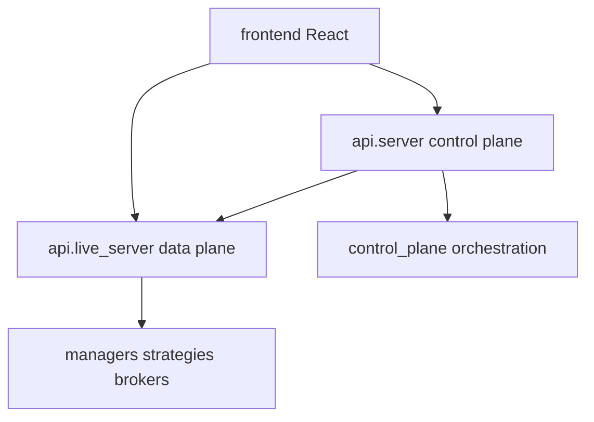

# Backtrading

Monorepo for **algorithmic trading operations**: a FastAPI control plane, per-strategy live engines, optional Telegram and Cursor agents, and a React UI.

## What runs where

| Process | Command | URL |
|---------|---------|-----|
| Control plane | `make cp` / `make dev` | http://localhost:8000 |
| Frontend | `make fe` / `make dev` | http://localhost:3000 |
| Live engine | Deploy from UI or `python -m api.live_server` | Ports 9000–9999 |

## Quick links

- [Quickstart](getting-started.md) — install and `make dev`
- [Architecture overview](architecture/index.md) — diagrams, classes, modules
- [Fake broker](guides/fake-broker.md) — run without broker credentials
- [Contributing](contributing.md)

## Repository layout (high level)

Python package (target): `src/backtrading/` — see [Migration overview](migration-overview.md).
