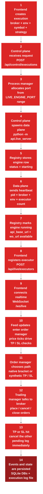
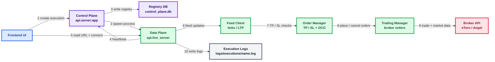

# Numbered Execution Workflow

This diagram is intentionally split into large numbered red step boxes so the sequence is readable in Markdown preview.

```mermaid
flowchart TB
    s1["1<br/>Frontend creates execution<br/>broker + env + symbol + strategy"]
    s2["2<br/>Control plane receives request<br/>POST /api/control/executions"]
    s3["3<br/>Process manager allocates port<br/>from LIVE_ENGINE_PORT range"]
    s4["4<br/>Control plane spawns data plane<br/>python -m api.live_server"]
    s5["5<br/>Registry stores engine row<br/>status = starting"]
    s6["6<br/>Data plane sends heartbeat<br/>pid + broker + env + executor count"]
    s7["7<br/>Registry marks engine running<br/>api_base_url + ws_url available"]
    s8["8<br/>Frontend registers executor<br/>POST /api/live/executors"]
    s9["9<br/>Frontend connects realtime<br/>WebSocket /ws/live"]
    s10["10<br/>Feed updates enter order manager<br/>price ticks drive TP / SL checks"]
    s11["11<br/>Order manager chooses path<br/>native bracket or synthetic TP / SL"]
    s12["12<br/>Trading manager talks to broker<br/>place / cancel / close orders"]
    s13["13<br/>TP or SL hit<br/>cancel the other pending leg immediately"]
    s14["14<br/>Events and state are persisted<br/>SQLite DBs + execution log file"]

    s1 --> s2 --> s3 --> s4 --> s5 --> s6 --> s7 --> s8 --> s9 --> s10 --> s11 --> s12 --> s13 --> s14

    classDef numberedStep fill:#dc2626,stroke:#ffffff,color:#ffffff,stroke-width:6px,font-size:24px,font-weight:bold;
    classDef finalStep fill:#991b1b,stroke:#ffffff,color:#ffffff,stroke-width:6px,font-size:24px,font-weight:bold;

    class s1,s2,s3,s4,s5,s6,s7,s8,s9,s10,s11,s12,s13 numberedStep;
    class s14 finalStep;
```

## Component Map

```mermaid
flowchart LR
    frontend["Frontend UI"]
    control["Control Plane<br/>api.server:app"]
    registry["Registry DB<br/>control_plane.db"]
    engine["Data Plane<br/>api.live_server"]
    feed["Feed Client<br/>ticks / LTP"]
    orderManager["Order Manager<br/>TP / SL + OCO"]
    tradingManager["Trading Manager<br/>broker orders"]
    broker["Broker API<br/>eToro / Angel"]
    logs["Execution Logs<br/>logs/executions/name.log"]

    frontend -->|"1 create execution"| control
    control -->|"2 spawn process"| engine
    control -->|"3 write registry"| registry
    engine -->|"4 heartbeat"| control
    frontend -->|"5 read URL + connect"| engine
    engine -->|"6 feed updates"| feed
    feed -->|"7 TP / SL checks"| orderManager
    orderManager -->|"8 place / cancel orders"| tradingManager
    tradingManager -->|"9 trade + market data"| broker
    engine -->|"10 write logs"| logs

    classDef ui fill:#dbeafe,stroke:#2563eb,color:#1e3a8a,stroke-width:3px,font-weight:bold;
    classDef controlClass fill:#ede9fe,stroke:#7c3aed,color:#3b0764,stroke-width:3px,font-weight:bold;
    classDef engineClass fill:#dcfce7,stroke:#16a34a,color:#14532d,stroke-width:3px,font-weight:bold;
    classDef brokerClass fill:#ffe4e6,stroke:#e11d48,color:#881337,stroke-width:3px,font-weight:bold;
    classDef storageClass fill:#f3f4f6,stroke:#4b5563,color:#111827,stroke-width:3px,font-weight:bold;

    class frontend ui;
    class control,registry controlClass;
    class engine,feed,orderManager,tradingManager engineClass;
    class broker brokerClass;
    class logs storageClass;
```
